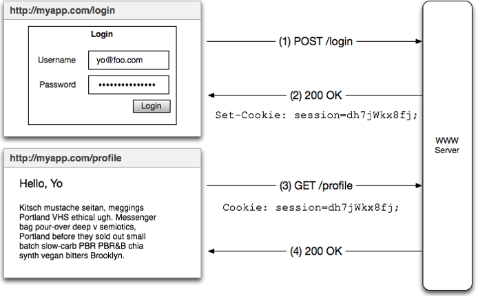
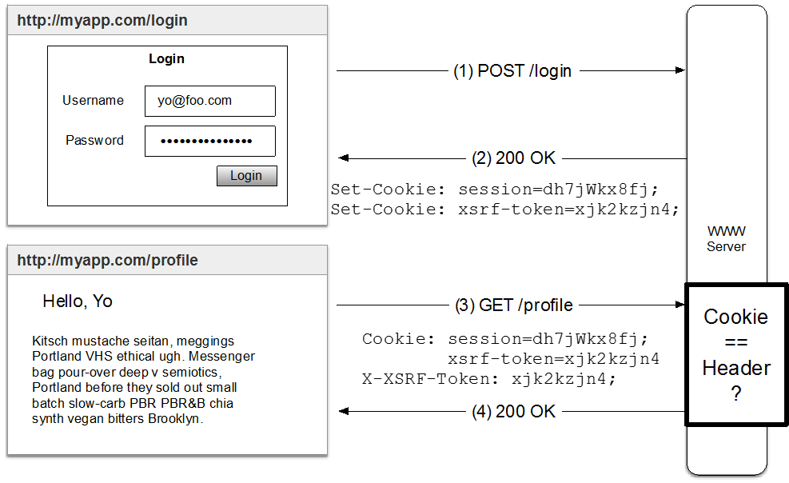
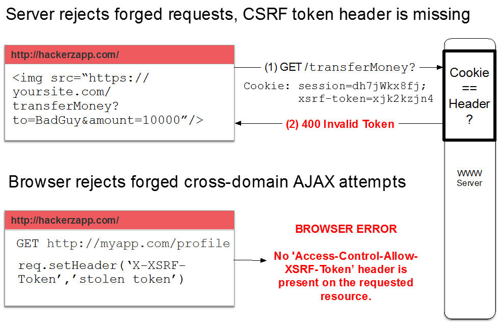
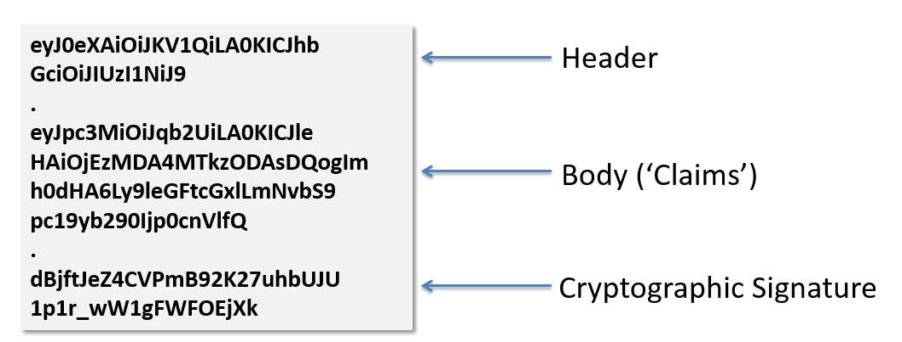
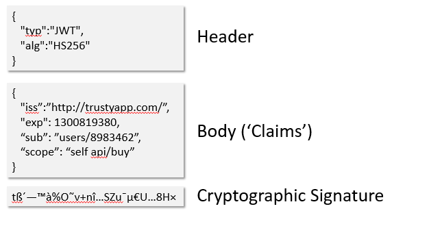

# Introdução

## Visão geral
<ul>
  <li>Recapitular: Session Identifiers</li>
  <li>Cookies, da maneira correta</li>
  <li>Introdução a JWT</li>
  <li>Access Tokens e Refresh Tokens</li>
  <li>Armazenando JWTs no browser</li>
  <li>Angular especificidades</li>
</ul>

### Recapitular: Session Identifiers

Identificadores de sessão, esse é uma maneira prática e simples para gerenciar uma sessão para um usuário que consiste básicamente em três passos:

<li>Verificar usuário e senha </li>
<li>Criar uma session ID e associar ao usuário</li>
<li>Guardar a session ID em um cookie</li>

a imagem abaixo detalha como isso acontece:


podemos ver que o usuário faz login e quando isso acontece é enviando o login e senha via POST estando tudo certo o servidor retorna um http statusCode 200 e seta um ID para a sessão
armazena esse session ID em um cookie e quando o usuário fizer uma requisição para profile por exemplo é feito um get nesse cookie e nesse momento ocorre uma verificação se o session ID for igual ao que foi enviando pelo servidor então e retornado um 200 e para cada requisição tudo ocorre asim.

<b>Preocupação com session ID</b>

<ul>
  <li>eles não tem nenhum significado são códigos gerados aleatoreamente</li>
  <li>aumenta a carga ao banco de dados, é feita uma pesquisa pelo session ID em cada requisição</li>
  <li>precisam ser protegidos para evitar ataques a sessão</li>
</ul>

### Cookies, da maneira correta

Cookies podem ser facilmente comprometidos:

<ul>
  <li>Man-in-the-middle (MITM)</li>
  <li>Cross-Site Scripting (XSS)</li>
  <li>Cross-Site Request Forgery (CSRF)</li>
</ul>

<b>Man-in-the-middle (MITM)</b>

Alguém pode ouvir a conversa entre o browser e o servidor e interceptar e roubar o cookie durante essa 'conversa'

<i>Solução:</i>
<li>Usar HTTPS/TLS em todos os locais onde um cookie irá transitar</li>
<li>Set secure flag no cookie</li>

<b>Cross-Site Scripting (XSS)</b>

Esse é um problema real, e ocorre quando alguém roda um script mal intencionado dentro do browser direcionado para o dominio a ser atacado e pode ser usado para roubar cookies.

aqui temos um exemplo isso [EXEMPLO](https://www.google.com/about/appsecurity/learning/xss/#StoredXSS).
podemos ver no exemplo que é executado um código malicioso no browser e com isso o atacante tem acesso a todos os nossos cookies.

<i>Solução:</i>
<li>Server Side: usar bibliotecas conhecidas e confiáveis para garantir que o HTML dinâmico não contém código executável. que não foi gerado por nós é claro.</li>
<li>Client Side: verificar inputs em forms enviandos pelo usuário existem frameworks que podem fazer isso por nós, mas é sempre bom ver a documentação.</li>
<li>Setar o atributo HttpOnly para authenticação dos cookies. <b>Com HttpOnly os cookies não são acessíveis pelo javascript environment.</b></li>

links de exemplo:
https://www.owasp.org/index.php/XSS </br>
https://www.google.com/about/appsecurity/learning/xss/

<b>Cross-Site Request Forgery (CSRF)</b>

Explora o fato de tags HTML não seguir a mesma política de origem ao fazer solicitações GET.

exemplo: um atacante coloca uma imagem com conteúdo malicioso dentro de uma pagina WEB que seus usuários visitam.
````

````
o que irá acontecer aqui é:
<li>o browser irá enviar cookies para trustapp.com.</li>
<li>o servidor enviar um cookie confiável e assume que foi uma ação do usuário.</li>
<li>transfere o dinheiro.</li>

<i>Solução:</i>
<li>Sincronizar token (para aplicações form-based)</li>
<li>Double-submit cookie ( para aplicações modernas)</li>

Double-submit cookie </br>

<li>cliente tem dois cookies, o um é session ID e o segundo é um valor random.</li>
<li>Client envia de volta um valor random no header, desencadeando o same-origin-policy.</li>

a imagem abaixo detalha como isso acontece:


e o servidor agora sabe tratar e rejeitar a ação maliciosa.

a imagem abaixo detalha como isso acontece:


para saber mais:
https://www.owasp.org/index.php/Cross-Site_Request_Forgery_(CSRF) </br>
https://developer.mozilla.org/en-US/docs/Web/Security/Same-origin_policy </br>

### Introdução a JWT

<b>Definição</b>

<li><b>Authenticação:</b> é quando provamos quem somos.</li>

<li><b>Authorização:</b> é quando garantimos que temos acesso algum resource.</li>

<li><b>Tokens:</b> são usados para persistir a authenticação e para pegar ( get ) a authorização.</li>

<li><b>JWT:</b> é um formato de token.</li>

<b> JSON web tokens (JWT) </b>

um JWT parece com uma string sem sentido algo do tipo
````
eyJ0eXAiOiJKV1QiLA0KICJhbGciOiJIUzI1NiJ9.eyJ
pc3MiOiJqb2UiLA0KICJleHAiOjEzMDA4MTkzODAsDQo
gImh0dHA6Ly9leGFtcGxlLmNvbS9pc19yb290Ijp0cnV
lfQ.dBjftJeZ4CVPmB92K27uhbUJU1p1r_wW1gFWFOEj
Xk
````
mas ele não é 'sem sentido', o JWT consiste em uma estrutura
com três partes encodadas em Base64-URL:



e esse mesmo JWT decodificado fica dessa forma:



o body do JWT é a parte mais importante e está dividida da seguinte forma:

````json
{
  "iss":"http://trustapp.com/", <---- quem emitiu o token.
  "exp":"1300819380", <---- quando vai expirar.
  "sub":"users/258594", <---- quem representa ( usuário ).
  "scope":"self api/buy", <--- o que pode fazer.
}
````

<b>Enviando e verificando JWTs </b>

Enviando JWTs:
<li>User tem que apresentar credenciais para ter um token (password , api keys).</li>
<li>Tokens são enviados pelo servidor e assinados com uma chave secreta que é privada.</li>
<li>O client guarda o token e o usa para authenticar os requests.</li>

Verificando JWTs:
<li>Deve checar a assinatura e tempo para expiração ( stateless authentication ).</li>
<li>Token declara o scopo, tomar decisões de autorização localmente.</li>
<li>mas como revogar stateless authentication.</li>

<b>OAuth2 + JWT ( Access & Refresh Tokens )</b>

Access & Refresh tokens:
<li>O cliente tem acesso e atualiza o token.</li>
<li>Access token expira antes da atualização do token.</li>
<li>Refresh token é usado para pegar mais access tokens.</li>
<li>Access tokens são confiáveis por assinatura.</li>
<li>Refresh tokens são checados para revogação.</li>

Lhe da o controle baseado no tempo de troca: stateless confiável vs Database lookup.

<i>Exemplos:</i>
<ul>
  <li>Super-seguro ( se deseja forçar o usuário a sair rapido: )
    <ul>
      <li>Access token TTL = 1 minuto</li>
      <li>Refresh token TTL = 30 minutos</li>
    </ul>
  </li>
  <li>Mobile/social app ( usuário deve ficar sempre logado )
    <ul>
      <li>Access token TTL = 1 hora</li>
      <li>Refresh token TTL == 4 anos</li>
    </ul>
  </li>
</ul>
<b>Armazenando e transmitindo JWTs ( no browser )</b>

<i>preocupações</i>:
<ul>
  <li>Local storage não é seguro ( XSS vulnerabilidade)</li>
  <li>Cookies são segures, com <b>HttpOnly</b>, <b>Secure</b> Flags e CSRF prevenção.</li>
  <li>Usando o header <i>Authorização</i> fica legal mas não é realmente necessário.</li>
  <li>Cross-domain request são sempre um inferno :D</li>
</ul>

Lógica de authenticação usnado cookies:
<ul>
  <li> Existe um token e acesso? ele é valido? ( assinatura e expiração)?
    <ul>
      <li>Sim? libera o request!</li>
      <li>Não? tente pegar um novo access token, usando o refresh token
      <ul>
        <li>Isso funcionou?
        <ul>
          <li>Sim? libera o request e manda o novo acess token no response como cookie.</li>
          <li>Não? Rejeita o request e deleta o refresh token cookie.</li>
        </ul>
        </li>
      </ul>
    </li>
    </ul>
  </li>
</ul>

## Entãooo... AngularJS?

<b>JWT com angularJS</b>
<li>Como eu vou saber se um usuário está logado?</li>
<li>Como eu vou saber se um usuário tem acesso a view?</li>
<li>Como eu vou saber se um usuário está com acesso removido?</li>

O usuário está logado?
<li>Cookies não pode lhe dizer isso, se estivermos usando HttpOnly</li>
<li>Vamos fazer um request para '/me' route com solicitação do token authentication</li>
<li>O route retorna o objeto do usuário</li>
<li>Use uma promisse para retornar esse objeto</li>
exemplo:
````js
angular.module('myapp')
  .config(function($stateProvider) {
    $stateProvider
      .state('home', {
        url:'/',
        templateUrl: 'views/home.html',
        resolve: {
          user: function($auth) {
            return $auth.getUser();
          }
        }
        })
    })
````

<li>UI Router: usa $stateChangeError para enviar qualquer erro da promisse, e direcionar para a view login.</li>
<li>ngRoute: $routeChangeError</li>
<ul>
  <li> manter $rootScope.user
    <ul>
      <li> null = nós não sabemos quem é</li>
      <li> fakse = não esta logado</li>
      <li> { } = nos temos um usuário data</li>
    </ul>
  </li>
<ul>
<li>Transmissão $authenticated é o evento disparado quando o usuário é conhecido.</li>

<b>Verificar o acesso do usuário para a view</b>
exemplo:
````js
$stateProvider
  .state('home', {
    url:'/',
    templateUrl:'views/home.html',
    resolve: {
      user: function($auth) {
        return $auth.getUser()
          .then(function(user) {
            // pode ter acesso a view?
            return true/false;
            })
      }
    }
    })
````

<b>Se o acesso foi removido?</b>
<li>Se recebermos um 401 como statusCode a transmissão do evento ocorre em $unauthenticated event</li>
<li>Redireciona para login view.</li>
